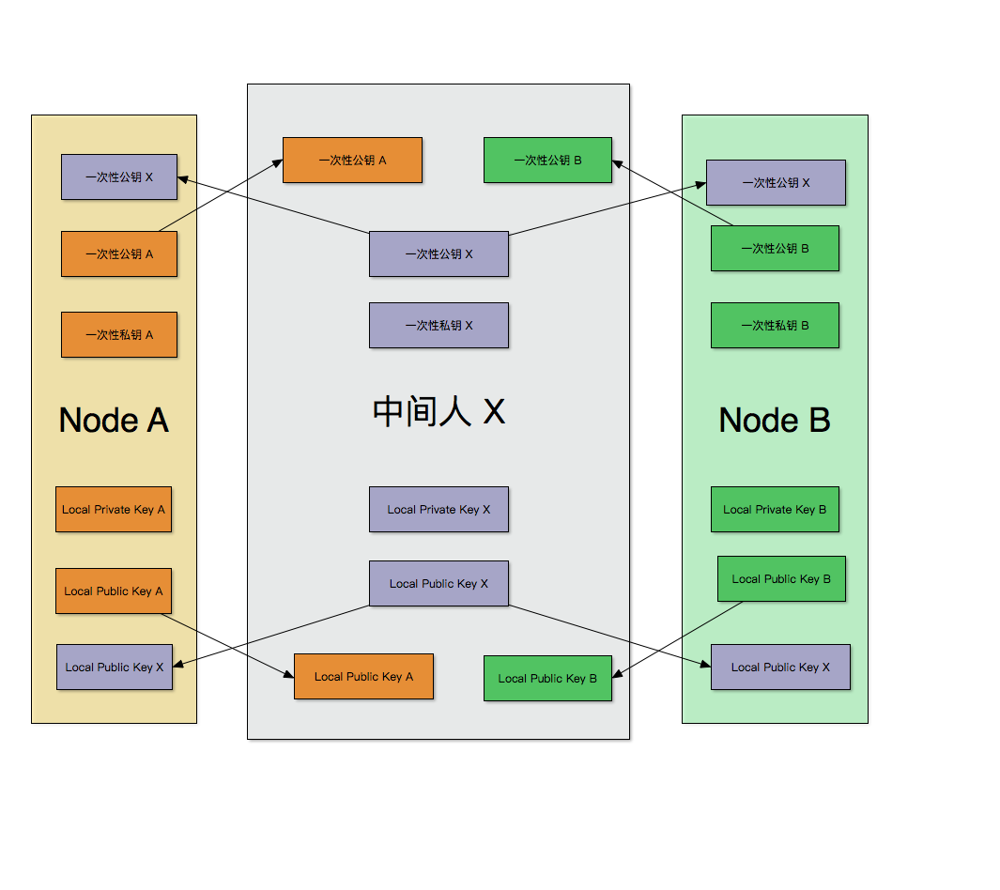
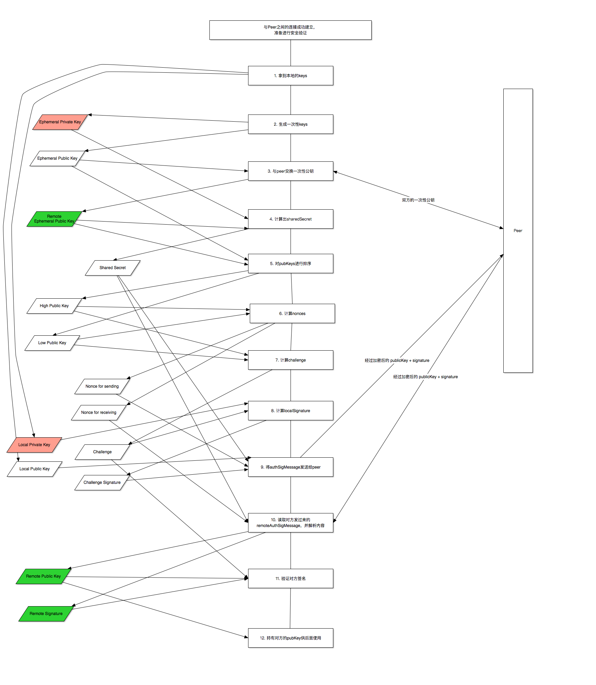

如何连上一个比原节点
=================

在上一篇我们已经知道了比原是如何监听节点的p2p端口，本篇就要继续在上篇中提到的问题：我们如何成功的连接上比原的节点，并且通过身份验证，以便后续继续交换数据？

在上一篇中，我们的比原节点是以`solonet`这个`chain_id`启动的，它监听的是`46658`端口。我们可以使用`telnet`连上它：

```bash
$ telnet localhost 46658
Trying 127.0.0.1...
Connected to localhost.
Escape character is '^]'.
ט�S��%�z?��_�端��݂���U[e
```

可以看到，它发过来了一些乱码。这些乱码是什么意思？我们应该怎么应答它？这是本篇将要回答的问题。

### 定位发送代码

首先我们得定位到比原向刚连接上来的节点发送数据的地方。说实话，这里实在是太绕了，山路十八弯，每次我想找到这段代码，都需要花好一阵功夫。所以下面这段流程，我觉得你以后可能经常会过来看看。

总的来说，在比原中有一个`Switch`类，它用于集中处理节点与外界交互的逻辑，而它的创建和启动，又都是在`SyncManager`中进行的。另外，监听p2p端口并拿到相应的连接对象的操作，与跟连接的对象进行数据交互的操作，又是分开的，前者是在创建`SyncManager`的时候进行的，后者是在`SyncManager`的启动(`Start`)方法里交由`Switch`进行的。所以总体来说，这一块逻辑有点复杂（乱），绕来绕去的。

这里不先评价代码的好坏，我们还是先把比原的处理逻辑搞清楚吧。

下面还是从启动开始，但是由于我们在前面已经出现过多次，所以我会尽量把不需要的代码省略掉，带着大家快速到达目的地，然后再详细分析。

首先是`bytomd node`的入口函数：

[cmd/bytomd/main.go#L54](https://github.com/freewind/bytom-v1.0.1/blob/master/cmd/bytomd/main.go#L54)

```go
func main() {
    cmd := cli.PrepareBaseCmd(commands.RootCmd, "TM", os.ExpandEnv(config.DefaultDataDir()))
    cmd.Execute()
}
```

转交给处理参数`node`的函数：

[cmd/bytomd/commands/run_node.go#L41](https://github.com/freewind/bytom-v1.0.1/blob/master/cmd/bytomd/commands/run_node.go#L41)
```go
func runNode(cmd *cobra.Command, args []string) error {
    // Create & start node
    n := node.NewNode(config)
    if _, err := n.Start(); err != nil {
    // ...
}
```

如前一篇所述，“监听端口”的操作是在`node.NewNode(config)`中完成的，这次发送数据的任务是在`n.Start()`中进行的。

但是我们还是需要看一下`node.NewNode`，因为它里在创建`SyncManager`对象的时候，生成了一个供当前连接使用的私钥，它会在后面用到，用于产生公钥。

[node/node.go#L59-L142](https://github.com/freewind/bytom-v1.0.1/blob/master/node/node.go#L59-L142)

```go
func NewNode(config *cfg.Config) *Node {
    // ...
    syncManager, _ := netsync.NewSyncManager(config, chain, txPool, newBlockCh)
    // ...
}
```

[netsync/handle.go#L42-L82](https://github.com/freewind/bytom-v1.0.1/blob/master/netsync/handle.go#L42-L82)

```go
func NewSyncManager(config *cfg.Config, chain *core.Chain, txPool *core.TxPool, newBlockCh chan *bc.Hash) (*SyncManager, error) {
    manager := &SyncManager{
        txPool:     txPool,
        chain:      chain,
        privKey:    crypto.GenPrivKeyEd25519(),
        // ...
}
```

就是这个`privKey`，它是通过`ed25519`生成的，后面会用到。这个私钥仅在本次连接中使用，每个连接都会生成一个新的。

让我们再回到主线`runNode`，其中`n.Start`又将被转交到`Node`的`OnStart`方法：

[node/node.go#L169](https://github.com/freewind/bytom-v1.0.1/blob/master/node/node.go#L169)
```go
func (n *Node) OnStart() error {
    // ...
    n.syncManager.Start()
    // ...
}
```

转交到`SyncManager`的`Start`方法：

[netsync/handle.go#L141](https://github.com/freewind/bytom-v1.0.1/blob/master/netsync/handle.go#L141)
```go
func (sm *SyncManager) Start() {
    go sm.netStart()
    // ...
}
```

然后在另一个例程(goroutine)中调用了`netStart()`方法：

[netsync/handle.go#L121](https://github.com/freewind/bytom-v1.0.1/blob/master/netsync/handle.go#L121)
```go
func (sm *SyncManager) netStart() error {
    // Start the switch
    _, err := sm.sw.Start()
    // ...
}
```

在这里终于调用了`Switch`的`Start`方法（`sm.sw`中的`sw`就是一个`Switch`对象)：

[p2p/switch.go#L186](https://github.com/freewind/bytom-v1.0.1/blob/master/p2p/switch.go#L186)
```go
func (sw *Switch) OnStart() error {
    // ...
    // Start listeners
    for _, listener := range sw.listeners {
        go sw.listenerRoutine(listener)
    }
    // ...
}
```

这里的`sw.listeners`，就包含了监听p2p端口的listener。然后调用`listenerRoutine()`方法，感觉快到了。

[p2p/switch.go#L496](https://github.com/freewind/bytom-v1.0.1/blob/master/p2p/switch.go#L496)
```go
func (sw *Switch) listenerRoutine(l Listener) {
    // ...
    err := sw.addPeerWithConnectionAndConfig(inConn, sw.peerConfig)
    // ...    
}
```

在这里拿到了连接到p2p端口的连接对象`inConn`们，传入一堆参数，准备大刑伺候：

[p2p/switch.go#L643](https://github.com/freewind/bytom-v1.0.1/blob/master/p2p/switch.go#L643)
```go
func (sw *Switch) addPeerWithConnectionAndConfig(conn net.Conn, config *PeerConfig) error {
    // ...
    peer, err := newInboundPeerWithConfig(conn, sw.reactorsByCh, sw.chDescs, sw.StopPeerForError, sw.nodePrivKey, config)
    // ...
}
```

把需要的参数细化出来，再次传入：

[p2p/peer.go#L87](https://github.com/freewind/bytom-v1.0.1/blob/master/p2p/peer.go#L87)
```go
func newInboundPeerWithConfig(conn net.Conn, reactorsByCh map[byte]Reactor, chDescs []*ChannelDescriptor, onPeerError func(*Peer, interface{}), ourNodePrivKey crypto.PrivKeyEd25519, config *PeerConfig) (*Peer, error) {
    return newPeerFromConnAndConfig(conn, false, reactorsByCh, chDescs, onPeerError, ourNodePrivKey, config)
}
```

再继续，马上就到了。

[p2p/peer.go#L91](https://github.com/freewind/bytom-v1.0.1/blob/master/p2p/peer.go#L91)
```go
func newPeerFromConnAndConfig(rawConn net.Conn, outbound bool, reactorsByCh map[byte]Reactor, chDescs []*ChannelDescriptor, onPeerError func(*Peer, interface{}), ourNodePrivKey crypto.PrivKeyEd25519, config *PeerConfig) (*Peer, error) {
    // ...
    // Encrypt connection
    if config.AuthEnc {
        // ...
        conn, err = MakeSecretConnection(conn, ourNodePrivKey)
        // ...
    }
    // ...
}
```

终于到了关键的函数`MakeSecretConnection()`了。由于`config.AuthEnc`的默认值是`true`，所以如果没有特别设置的话，它就会进入`MakeSecretConnection`，在这里完成身份验证等各种操作，它也是我们本篇讲解的重点。

好，下面我们开始。

### 详解MakeSecretConnection

这个函数的逻辑看起来是相当复杂的，引入了很多密钥和各种加解密，还多次跟相应的peer进行数据发送和接收，如果不明白它为什么要这么做，是很难理解清楚的。好在一旦理解以后，明白了它的意图，整个就简单了。

总的来说，比原的节点之间的数据交互，是需要很高的安全性的，尤其是数据不能明文传送，否则一旦遇到了坏的“中间人”（可以理解为数据从一个节点到另一个节点中途需要经过的各种网关、路由器、代理等等），数据就有可能被窃取甚至修改。考虑一下这个场景：用户A想把100万个比原从自己的帐号转到用户B的帐户，结果信息被中间人修改，最后转到了中间人指定的帐户C，那么这损失就大了，甚至无法追回。（有同学问，“区块链上的每个交易不是会有多个节点验证吗？如果只有单一节点使坏，应该不会生效吧”。我考虑的是这样一种情况，比如某用户在笔记本上运行比原节点，然后在公开场合上网，使用了黑客提供的wifi。那么该节点与其它结点的所有连接都可以被中间人攻击，广播出去的交易可以同时被修改，这样其它节点拿到的都是修改后的交易。至于这种方法是否可以生效，还需要我读完更多的代码才能确定，这里暂时算是一个猜想吧，等我以后再来确认）

所以比原节点之间传输信息的时候是加密的，使用了某些非对称加密的方法。这些方法需要在最开始的时候，节点双方都把自己的公钥转给对方，之后再发信息时就可以使用对方的公钥加密，再由对方使用私钥解密。加密后的数据，虽然还会经过各种中间人的转发才能到达对方，但是只要中间人没有在最开始拿到双方的明文公钥并替换成自己的假冒公钥，它就没有办法知道真实的数据是什么，也就没有办法窃取或修改。

所以这个函数的最终目的，就是：把自己的公钥安全的发送给对方，同时安全得拿到对方的公钥。

如果仅仅是发送公钥，那本质上就是发送一些字节数据过去，应该很简单。但是比原为了达到安全的目的，还进行了如下的思考：

1. 只发送公钥还不够，还需要先用我的私钥把一段数据签个名，一起发过去，让对方验证一下，以保证我发过去的公钥是正确的
2. 明文发送公钥不安全，所以得把它加密一下再发送
3. 为了加密发送，我和对方都需要生成另一对一次性的公钥和私钥，专门用于这次加密，用完后就丢掉
4. 为了让我们双方都能正确的加解密，所以需要找到一种方式，在两边生成同样的用于签名的数据（`challenge`）和加解密时需要的参数（`sharedSecret`, `sendNonce/recvNonce`）

另外还有一些过度的考虑：

1. 在发送加密数据的时候，担心每次要发送的数据过多，影响性能，所以把数据分成多个块发送
2. 为了配合多次发送和接收，还需要考虑如何让两边的`sendNonce`和`recvNonce`保持同步改变
3. 在发送公钥及签名数据时，把它们包装成了一个对象，再进行额外的序列化和反序列化操作

我之所以认为这些是“过度”的考虑，是因为在这个交互过程中，数据的长度是固定的，并且很短（只有100多个字节），根本不需要考虑分块。另外公钥和签名数据就是两个简单的、长度固定的字节数组，并且只在这里用一次，我觉得可以直接发送两个数组即可，包装成对象及序列化后，我们还需要考虑序列化之后的数组长度是如何变化的。

在查阅了相关的代码以后，我发现这一处逻辑只在这里使用了一次，没有必要提前考虑到通用但更复杂的情况，提前编码。毕竟那些情况有可能永远不会发生，而提前写好的代码所增加的复杂度以及可能多出来的bug却是永远存在了。

《敏捷软件开发 原则、模式和实践》这本书告诉我们：不要预先设计，尽量用简单的办法实现，等到变化真的到来了，再考虑如何重构让它适应这种变化。

下面讲解“MakeSecretConnection”，由于该方法有点长，所以会分成几块：

[p2p/listener.go#L52](https://github.com/freewind/bytom-v1.0.1/blob/master/p2p/listener.go#L52)

```go
func MakeSecretConnection(conn io.ReadWriteCloser, locPrivKey crypto.PrivKeyEd25519) (*SecretConnection, error) {

    locPubKey := locPrivKey.PubKey().Unwrap().(crypto.PubKeyEd25519)

```

首先注意的是参数`locPrivKey`，它就是在前面最开始的时候，在`SyncManager`中生成的用于本次连接通信的私钥。然后根据该私钥，生成对应的公钥，对于同一个私钥，生成的公钥总是相同的。

这个私钥的长度是64字节，公钥是32字节，可见两者不是一样长的。公钥短一些，更适合加密（速度快一点）。

呆会儿在最后会使用该私钥对一段数据进行签名，然后跟这个公钥一起，经过加密后发送给peer，让他验证。成功之后，对方会一直持有这个公钥，向我们发送数据前会用它对数据进行加密。

接着，

```go
    // Generate ephemeral keys for perfect forward secrecy.
    locEphPub, locEphPriv := genEphKeys()
```

这里生成了一对一次性的公私钥，用于本次连接中对开始那个公钥（和签名数据）进行加密。

待会儿会发把这里生成的`locEphPub`以明文的方式传给对方（为什么是明文？因为必须得有一次明文发送，不然对方一开始就拿到加密的数据没法解开），它就我们在本文开始通过`telnet localhost 46658`时收到的那一堆乱码。

`genEphKeys()`，对应于：

[p2p/secret_connection.go#L189](https://github.com/freewind/bytom-v1.0.1/blob/master/p2p/secret_connection.go#L189)
```go
func genEphKeys() (ephPub, ephPriv *[32]byte) {
    var err error
    ephPub, ephPriv, err = box.GenerateKey(crand.Reader)
    if err != nil {
        cmn.PanicCrisis("Could not generate ephemeral keypairs")
    }
    return
}
```

它调用了`golang.org/x/crypto/nacl/box`的`GenerateKey`函数，在内部使用了`curve25519`算法，生成的两个key的长度都是32字节。

可以看到，它跟前面的公私钥的长度不是完全一样的，可见两者使用了不同的加密算法。前面的是`ed25519`，而这里是`curve25519`。

接着回到`MakeSecretConnection`，继续:

```go
    // Write local ephemeral pubkey and receive one too.
    // NOTE: every 32-byte string is accepted as a Curve25519 public key
    // (see DJB's Curve25519 paper: http://cr.yp.to/ecdh/curve25519-20060209.pdf)
    remEphPub, err := shareEphPubKey(conn, locEphPub)
    if err != nil {
        return nil, err
    }
```

这个`shareEphPubKey`就是把刚生成的一次性的`locEphPub`发给对方，同时也从对方那里读取对方生成的一次性公钥（长度为32字节）：

[p2p/secret_connection.go#L198](https://github.com/freewind/bytom-v1.0.1/blob/master/p2p/secret_connection.go#L198)
```go
func shareEphPubKey(conn io.ReadWriteCloser, locEphPub *[32]byte) (remEphPub *[32]byte, err error) {
    var err1, err2 error

    cmn.Parallel(
        func() {
            _, err1 = conn.Write(locEphPub[:])
        },
        func() {
            remEphPub = new([32]byte)
            _, err2 = io.ReadFull(conn, remEphPub[:])
        },
    )

    if err1 != nil {
        return nil, err1
    }
    if err2 != nil {
        return nil, err2
    }

    return remEphPub, nil
}
```

由于`MakeSecretConnection`这个函数，是两个比原节点在建立起p2p连接时都会执行的，所以两者要做的事情都是一样的。如果我发了数据，则对方也会发相应的数据，然后两边都需要读取。所以我发了什么样的数据，我也要同时拿到什么样的数据。

再回想本文开始提到的`telnet localhost 46658`，当我们接收到那一段乱码时，也需要给对方发过去32个字节，双方才能进行下一步。

再回到`MakeSecretConnection`，接着：

```go
    // Compute common shared secret.
    shrSecret := computeSharedSecret(remEphPub, locEphPriv)
```

双方拿到对方的一次性公钥后，都会和自己生成的一次性私钥（注意，是私钥）做一个运算，生成一个叫`shrSecret`的密钥在后面使用。怎么用呢？就是用它来对要发送的公钥及签名数据进行加密，以及对对方发过来的公钥和签名数据进行解密。

`computeSharedSecret`函数对应的代码是这样：

[p2p/secret_connection.go#L221](https://github.com/freewind/bytom-v1.0.1/blob/master/p2p/secret_connection.go#L221)
```go
func computeSharedSecret(remPubKey, locPrivKey *[32]byte) (shrSecret *[32]byte) {
    shrSecret = new([32]byte)
    box.Precompute(shrSecret, remPubKey, locPrivKey)
    return
}
```

它是通过对方的公钥和自己的私钥算出来的。

这里有一个神奇的地方，就是双方算出来的`shrSecret`是一样的！也就是说，假设这里使用该算法（`curve25519`）生成了两对公私钥：

```go
privateKey1, publicKey1
privateKey2, publicKey2
```

并且

```go
publicKey2 + privateKey1 ===> sharedSecret1
publicKey1 + privateKey2 ===> sharedSecret2
```

那么`sharedSecret1`和`sharedSecret2`是一样的，所以双方才可以拿各自算出来的`shrSecret`去解密对方的加密数据。

再接着，会根据双方的一次性公钥做一些计算，以供后面使用。

```go
    // Sort by lexical order.
    loEphPub, hiEphPub := sort32(locEphPub, remEphPub)
```

首先是拿对方和自己的一次性公钥进行排序，这样两边得到的`loEphPub`和`hiEphPub`就是一样的，后面在计算数值时就能得到相同的值。

然后是计算nonces，

```go
    // Generate nonces to use for secretbox.
    recvNonce, sendNonce := genNonces(loEphPub, hiEphPub, locEphPub == loEphPub)
```

`nonces`和前面的`shrSecret`都是在给公钥和签名数据加解密时使用的。其中`shrSecret`是固定的，而nonce在不同的信息之间是应该不同的，用于区别信息。

这里计算出来的`recvNonce`与`sendNonce`，一个是用于接收数据后解密，一个是用于发送数据时加密。连接双方的这两个数据都是相反的，也就是说，一方的`recvNonce`与另一方的`sendNonce`相等，这样当一方使用`sendNonce`加密后，另一方才可以使用相同数值的`recvNonce`进行解密。

在后面我们还可以看到，当一方发送完数据后，其持有的`sendNonce`会增2，另一方接收并解密后，其`recvNonce`也会增2，双方始终保持一致。（为什么是增2而不是增1，后面有解答）

`genNonces`的代码如下：

[p2p/secret_connection.go#L238](https://github.com/freewind/bytom-v1.0.1/blob/master/p2p/secret_connection.go#L238)

```go
func genNonces(loPubKey, hiPubKey *[32]byte, locIsLo bool) (recvNonce, sendNonce *[24]byte) {
    nonce1 := hash24(append(loPubKey[:], hiPubKey[:]...))
    nonce2 := new([24]byte)
    copy(nonce2[:], nonce1[:])
    nonce2[len(nonce2)-1] ^= 0x01
    if locIsLo {
        recvNonce = nonce1
        sendNonce = nonce2
    } else {
        recvNonce = nonce2
        sendNonce = nonce1
    }
    return
}
```

可以看到，其中的一个nonce就是把前面排序后的`loPubKey`和`hiPubKey`组合起来，而另一个nonce就是把最后一个bit的值由0变成1（或者由1变成0），这样两者就会是一个奇数一个偶数。而后来在对nonce进行自增操作的时候，每次都是增2，这样就保证了`recvNonce`与`sendNonce`不会出现相等的情况，是一个很巧妙的设计。

后面又通过判断`local is loPubKey`，保证了两边得到的`recvNonce`与`sendNonce`正好相反，且一边的`recvNonce`与另一边的`sendNonce`正好相等。

再回到`MakeSecretConnection`，继续：

```go
    // Generate common challenge to sign.
    challenge := genChallenge(loEphPub, hiEphPub)
```

这里根据`loEphPub`和`hiEphPub`计算出来`challenge`，在后面将会使用自己的私钥对它进行签名，再跟公钥一起发给对方，让对方验证。由于双方的`loEphPub`和`hiEphPub`是相等的，所以算出来的`challenge`也是相等的。

[p2p/secret_connection.go#L253](https://github.com/freewind/bytom-v1.0.1/blob/master/p2p/secret_connection.go#L253)

```go
func genChallenge(loPubKey, hiPubKey *[32]byte) (challenge *[32]byte) {
    return hash32(append(loPubKey[:], hiPubKey[:]...))
}
```

可以看到`genChallenge`就是把两个一次性公钥放在一起，并做了一个hash操作，得到了一个32字节的数组。

其中的`hash32`采用了`SHA256`的算法，它生成摘要的长度就是32个字节。

[p2p/secret_connection.go#L303](https://github.com/freewind/bytom-v1.0.1/blob/master/p2p/secret_connection.go#L303)
```go
func hash32(input []byte) (res *[32]byte) {
    hasher := sha256.New()
    hasher.Write(input) // does not error
    resSlice := hasher.Sum(nil)
    res = new([32]byte)
    copy(res[:], resSlice)
    return
}
```

再回到`MakeSecretConnection`，继续：

```go
    // Construct SecretConnection.
    sc := &SecretConnection{
        conn:       conn,
        recvBuffer: nil,
        recvNonce:  recvNonce,
        sendNonce:  sendNonce,
        shrSecret:  shrSecret,
    }
```

这里是生成了一个`SecretConnection`的对象，把相关的nonces和`shrSecret`传过去，因为呆会儿对公钥及签名数据的加解密操作，都放在了那边，而这几个参数都是需要用上的。

前面经过了这么多的准备工作，终于差不多了。下面将会使用自己的私钥对`challenge`数据进行签名，然后跟自己的公钥一起发送给对方：

```go
    // Sign the challenge bytes for authentication.
    locSignature := signChallenge(challenge, locPrivKey)

    // Share (in secret) each other's pubkey & challenge signature
    authSigMsg, err := shareAuthSignature(sc, locPubKey, locSignature)
    if err != nil {
        return nil, err
    }
```

其中的`signChallenge`就是简单的使用自己的私钥对`challenge`数据进行签名，得到的是一个32字节的摘要：

```go
func signChallenge(challenge *[32]byte, locPrivKey crypto.PrivKeyEd25519) (signature crypto.SignatureEd25519) {
    signature = locPrivKey.Sign(challenge[:]).Unwrap().(crypto.SignatureEd25519)
    return
}
```

而在`shareAuthSignature`中，则是把自己的公钥与签名后的数据`locSignature`一起，经过`SecretConnection`的加密后传给对方，也同时从对方那里读取他的公钥和签名数据，再解密。由于这一块代码涉及的东西比较多（有分块，加解密，序列化与反序列化），所以放在后面再讲。

再然后，

```go
    remPubKey, remSignature := authSigMsg.Key, authSigMsg.Sig
    if !remPubKey.VerifyBytes(challenge[:], remSignature) {
        return nil, errors.New("Challenge verification failed")
    }
```

从对方传过来的数据中拿出对方的公钥和对方签过名的数据，对它们进行验证。由于对方在签名时，使用的`challenge`数据和我们这边产生的`challenge`一样，所以可以直接拿出本地的`challenge`使用。

最后，如果验证通过的话，则把对方的公钥也加到`SecretConnection`对象中，供以后使用。

```go
    // We've authorized.
    sc.remPubKey = remPubKey.Unwrap().(crypto.PubKeyEd25519)
    return sc, nil
}
```

到这里，我们就可以回答最开始的问题了：我们应该怎样连接一个比原节点呢？

答案就是：

1. 先连上对方的p2p端口
2. 读取32个字节，这是对方的一次性公钥
3. 把自己生成的一次性公钥发给对方
4. 读取对方经过加密后的公钥+签名数据，并验证
5. 把自己的公钥和签名数据经过加密后，发送给对方，等待对方验证
6. 如果两边都没有断开，则说明验证通过，后面就可以进行更多的数据交互啦

### 关于shareAuthSignature的细节

前面说到，当使用自己的私钥把`challenge`签名得到`locSignature`后，将通过`shareAuthSignature`把它和自己的公钥一起发给对方。它里做了很多事，我们在这一节详细讲解一下。

`shareAuthSignature`的代码如下：

[p2p/secret_connection.go#L267](https://github.com/freewind/bytom-v1.0.1/blob/master/p2p/secret_connection.go#L267)
```go
func shareAuthSignature(sc *SecretConnection, pubKey crypto.PubKeyEd25519, signature crypto.SignatureEd25519) (*authSigMessage, error) {
    var recvMsg authSigMessage
    var err1, err2 error

    cmn.Parallel(
        func() {
            msgBytes := wire.BinaryBytes(authSigMessage{pubKey.Wrap(), signature.Wrap()})
            _, err1 = sc.Write(msgBytes)
        },
        func() {
            readBuffer := make([]byte, authSigMsgSize)
            _, err2 = io.ReadFull(sc, readBuffer)
            if err2 != nil {
                return
            }
            n := int(0) // not used.
            recvMsg = wire.ReadBinary(authSigMessage{}, bytes.NewBuffer(readBuffer), authSigMsgSize, &n, &err2).(authSigMessage)
        })

    if err1 != nil {
        return nil, err1
    }
    if err2 != nil {
        return nil, err2
    }

    return &recvMsg, nil
}

```

可以看到，它做了这样几件事：

1. 首先是把公钥和签名数据组合成了一个`authSigMessage`对象：`authSigMessage{pubKey.Wrap(), signature.Wrap()}`
2. 然后通过一个叫`go-wire`的第三方库，把它序列化成了一个字节数组
3. 然后调用`SecretConnection.Write()`方法，把这个数组发给对方。需要注意的是，在这个方法内部，将对数据进行分块，并使用Go语言的`secretBox.Seal`对数据进行加密。
4. 同时从对方读取指定长度的数据（其中的`authSigMsgSize`为常量，值为`const authSigMsgSize = (32 + 1) + (64 + 1)`）
5. 然后通过`SecretConnection`对象中的方法读取它，同时进行解密
6. 然后再通过`go-wire`把它变成一个`authSigMessage`对象
7. 如果一切正常，把`authSigMessage`返回给调用者`MakeSecretConnection`

这里我觉得没有必要使用`go-wire`对数据进行序列化和反序列化，因为要发送的两个数组长度是确定的（一个32，一个64），不论是发送还是读取，都很容易确定长度和拆分规则。而引入了`go-wire`以后，就需要知道它的工作细节（比如它产生的字节个数是`(32 + 1) + (64 + 1)`），而这个复杂性是没有必要引入的。

### `SecretConnection`的`Read`和`Write`

在上一段，对于发送数据时的分块和加解密相关的操作，都放在了`SecretConnection`的方法中。比如`sc.Write(msgBytes)`和`io.ReadFull(sc, readBuffer)`（其中的`sc`都是指`SecretConnection`对象），用到的就是`SecretConnection`的`Write`和`Read`。

[p2p/secret_connection.go#L110](https://github.com/freewind/bytom-v1.0.1/blob/master/p2p/secret_connection.go#L110)

```go
func (sc *SecretConnection) Write(data []byte) (n int, err error) {
    for 0 < len(data) {
        var frame []byte = make([]byte, totalFrameSize)
        var chunk []byte
        if dataMaxSize < len(data) {
            chunk = data[:dataMaxSize]
            data = data[dataMaxSize:]
        } else {
            chunk = data
            data = nil
        }
        chunkLength := len(chunk)
        binary.BigEndian.PutUint16(frame, uint16(chunkLength))
        copy(frame[dataLenSize:], chunk)

        // encrypt the frame
        var sealedFrame = make([]byte, sealedFrameSize)
        secretbox.Seal(sealedFrame[:0], frame, sc.sendNonce, sc.shrSecret)
        // fmt.Printf("secretbox.Seal(sealed:%X,sendNonce:%X,shrSecret:%X\n", sealedFrame, sc.sendNonce, sc.shrSecret)
        incr2Nonce(sc.sendNonce)
        // end encryption

        _, err := sc.conn.Write(sealedFrame)
        if err != nil {
            return n, err
        } else {
            n += len(chunk)
        }
    }
    return
}
```

在`Write`里面，除了向连接对象写入数据（`sc.conn.Write(sealedFrame)`）外，它主要做了三件事：

1. 首先是如果数据过长（长度超过`dataMaxSize`，即`1024`），则要把它分成多个块。由于最后一个块的数据可能填不满，所以每个块的最开始要用2个字节写入本块中实际数据的长度。
2. 然后是调用Go的`secretbox.Seal`方法，对块数据进行加密，用到了`sendNonce`和`shrSecret`这两个参数
3. 最后是对`sendNonce`进行自增操作，这样可保证每次发送时使用的nonce都不一样；另外每次增2，这样可保证它不会跟`recvNonce`重复

而`SecretConnection`的`Read`操作，跟前面正好相反：

[p2p/secret_connection.go#L143](https://github.com/freewind/bytom-v1.0.1/blob/master/p2p/secret_connection.go#L143)
```go
func (sc *SecretConnection) Read(data []byte) (n int, err error) {
    if 0 < len(sc.recvBuffer) {
        n_ := copy(data, sc.recvBuffer)
        sc.recvBuffer = sc.recvBuffer[n_:]
        return
    }

    sealedFrame := make([]byte, sealedFrameSize)
    _, err = io.ReadFull(sc.conn, sealedFrame)
    if err != nil {
        return
    }

    // decrypt the frame
    var frame = make([]byte, totalFrameSize)
    // fmt.Printf("secretbox.Open(sealed:%X,recvNonce:%X,shrSecret:%X\n", sealedFrame, sc.recvNonce, sc.shrSecret)
    _, ok := secretbox.Open(frame[:0], sealedFrame, sc.recvNonce, sc.shrSecret)
    if !ok {
        return n, errors.New("Failed to decrypt SecretConnection")
    }
    incr2Nonce(sc.recvNonce)
    // end decryption

    var chunkLength = binary.BigEndian.Uint16(frame) // read the first two bytes
    if chunkLength > dataMaxSize {
        return 0, errors.New("chunkLength is greater than dataMaxSize")
    }
    var chunk = frame[dataLenSize : dataLenSize+chunkLength]

    n = copy(data, chunk)
    sc.recvBuffer = chunk[n:]
    return
}
```

它除了正常的读取字节外，也是做了三件事：

1. 按块读取，每次读满`sealedFrameSize`个字节，并按前两个字节指定的长度来确认有效数据
2. 对数据进行解密，使用`secretbox.Open`以及`recvNonce`和`shrSecret`这两个参数
3. 对`recvNonce`进行自增2的操作，以便与对方的`sendNonce`保持一致，供下次解密使用

需要注意的是，这个函数返回的`n`（已读取数据），是指的解密之后的，所以要比真实读取的数据小一点。另外，在前面的`shareAuthSignature`中，使用的是`io.ReadFull(sc)`，并且要读满`authSigMsgSize`个字节，所以假如数据过长的话，这个`Read`方法可能要被调用多次。

在这一块，由于作者假设了发送的数据的长度可能过长，所以才需要这么复杂的分块操作，而实际上是不需要的。如果我们简单点处理，是可以做到以下两个简化的：

1. 不需要分块，发送一次就够了
2. 也因此不需要计算和维护`recvNonce`和`sendNonce`，直接给个常量即可，反正只用一次，不会存在冲突

逻辑可以简单很多。而且我查了一下，这块代码在整个项目中，目前只使用了一次。如果未来真的需要，到时候再加也不迟。

### 目前的做法是否足够安全

从上面的分析我们可以看到，比原为了保证节点间通信的安全性，是做了大量的工作的。那么，当前的做法，是否可以完全杜绝中间人攻击呢？

按我的理解，还是不行的，因为如果有人完全清楚了比原的验证流程，还是可以写出相应的工具。比如，中间人可以按照下面的方式：

1. 中间人首先自己生成一对一次性公钥和一对最后用于签名和验证的公私钥(后面称为长期公钥)，用于假冒节点密钥
1. 当双方节点建立起连接时，中间人可以拿到双方的一次性公钥，因为它们是明文的
1. 中间人把自己生成的一次性公钥发给双方，假冒是来自对方节点的
1. 双方节点使用自己和中间人的一次性公钥，对数据进行加密传给对方，此时中间人拿到数据后，可以利用自己生成的假冒一次性公钥以及双方之前发过来的一次性公钥对其解密，从而拿到双方的长期公钥
1. 中间人将自己生成的长期公钥以及利用自己的长期私钥签名的数据发给双方节点
1. 双方节点拿到了中间人的长期公钥和签名数据，并验证通过
1. 最后双方节点都信任对方（实际上是信任了骗子中间人）
5. 之后双方节点向对方发送的信息（使用骗子提供的长期公钥加密），会被中间人使用相应的长期私钥解密，从而被窃取，甚至修改后再经过加密后转发给另一方，而另一方完全信任，会执行，从而导致损失

这个过程可以使用下图来辅助理解：



那么这是否说明比原的做法白做了呢？不，我认为比原的做法已经够用了。

按我目前的了解，对于防范中间人，并没有完全完美的办法（因为如何保证安全的把公钥通过网络发送给另一方本身就是一个充满挑战的问题），目前多数是证书等做法。对于比原来说，如果采用这种做法，会让节点的部署和维护麻烦很多。而目前的做法，虽然不能完全杜绝，但是其实已经解决了大部分的问题：

1. 没有明文发送真正的公钥，使得一些通用型的中间人工具无法使用
2. 在发送公钥时，以及对签名进行认证时，使用了两种不同类型的加密方案，并且它们在Go以外的语言的实现中，可能不太兼容，这就使得骗子必须也会使用Go来编程
3. 中间人必须读懂比原的代码并对此处每一个细节都清楚才可能写出正确的工具

我觉得这基本上就杜绝了一大拨技术能力不过关的骗子。只要我们在使用的时候，再注意防范（比如不使用不安全的网络或者代理），我觉得基本上就没什么问题了。

### 代码流程图

最后，把我阅读这段代码过程中画的流程图分享出来，也许对你自己阅读的时候有帮助：


